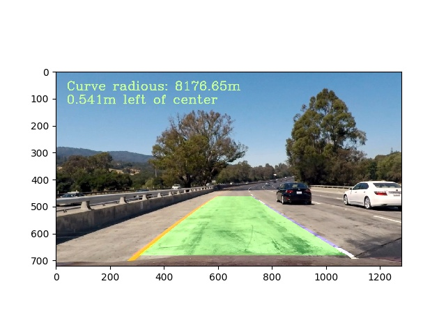

## Advanced Lane Finding

The Project
---

The goals / steps of this project are the following:

* Compute the camera calibration matrix and distortion coefficients given a set of chessboard images.
* Apply a distortion correction to raw images.
* Use color transforms, gradients, etc., to create a thresholded binary image.
* Apply a perspective transform to rectify binary image ("birds-eye view").
* Detect lane pixels and fit to find the lane boundary.
* Determine the curvature of the lane and vehicle position with respect to center.
* Warp the detected lane boundaries back onto the original image.
* Output visual display of the lane boundaries and numerical estimation of lane curvature and vehicle position.

The images for camera calibration are stored in the folder called `camera_cal`.  The images in `test_images` are for testing your pipeline on single frames.  If you want to extract more test images from the videos, you can simply use an image writing method like `cv2.imwrite()`, i.e., you can read the video in frame by frame as usual, and for frames you want to save for later you can write to an image file.  

Environment Set Up
---

**Step 1:** Set up the [CarND Term1 Starter Kit](https://github.com/udacity/CarND-Term1-Starter-Kit/blob/master/README.md) if you haven't already (Note: you'd better use Miniconda 4.4.10 and you might need to use `pip install --upgrade matplotlib` to update your `matplotlib` module).

**Step 2:** Open the code in a Jupyter Notebook

Implementation
---
All codes are included in `code` folder. The functions are built in `./code/src/functions.py`. The line type is defined in `./code/src/line.py`.

If you want to implement the static image process pipeline, please use `cd code` to jump to the `code` folder and run `python3 static_image_process.py`. 

if you want to implement the video process pipeline, pelase use `cd code` to jump to the `code` folder and run `python3 video process.py`.

Project Report
---

TO have access to the project report, please click [this link](https://github.com/Roger-Mei/CarND-Advanced-Lane-Lines/blob/master/project_report.md).

